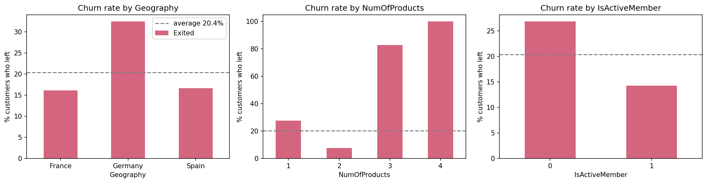
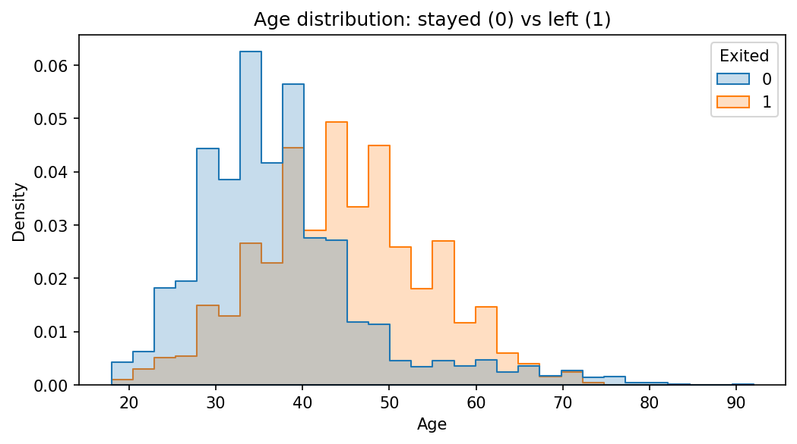
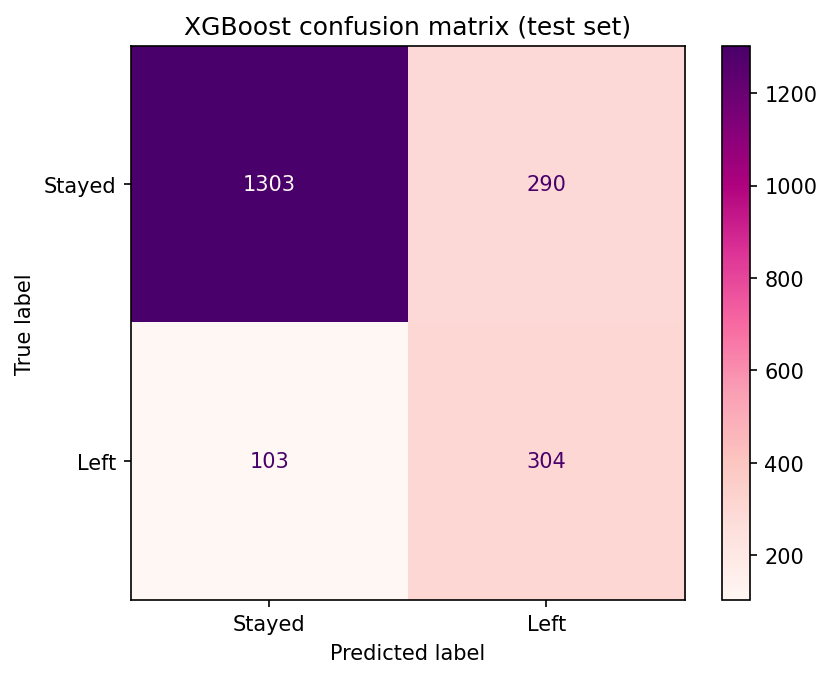
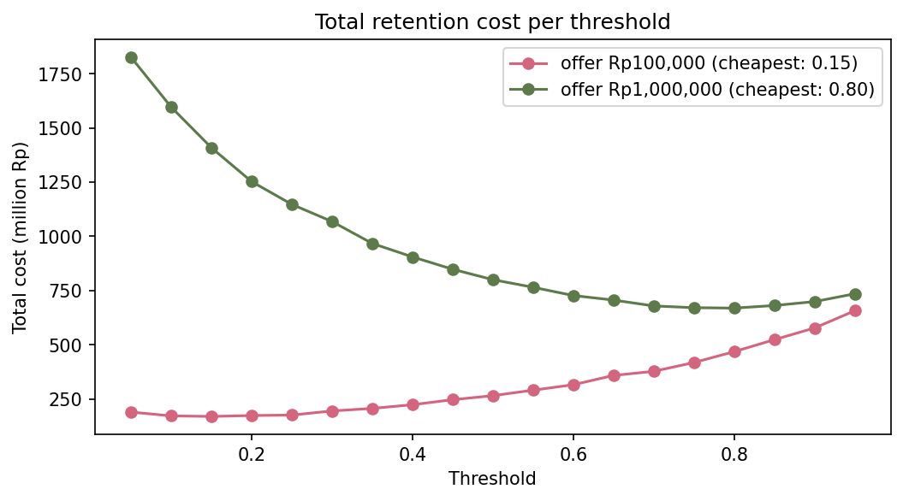
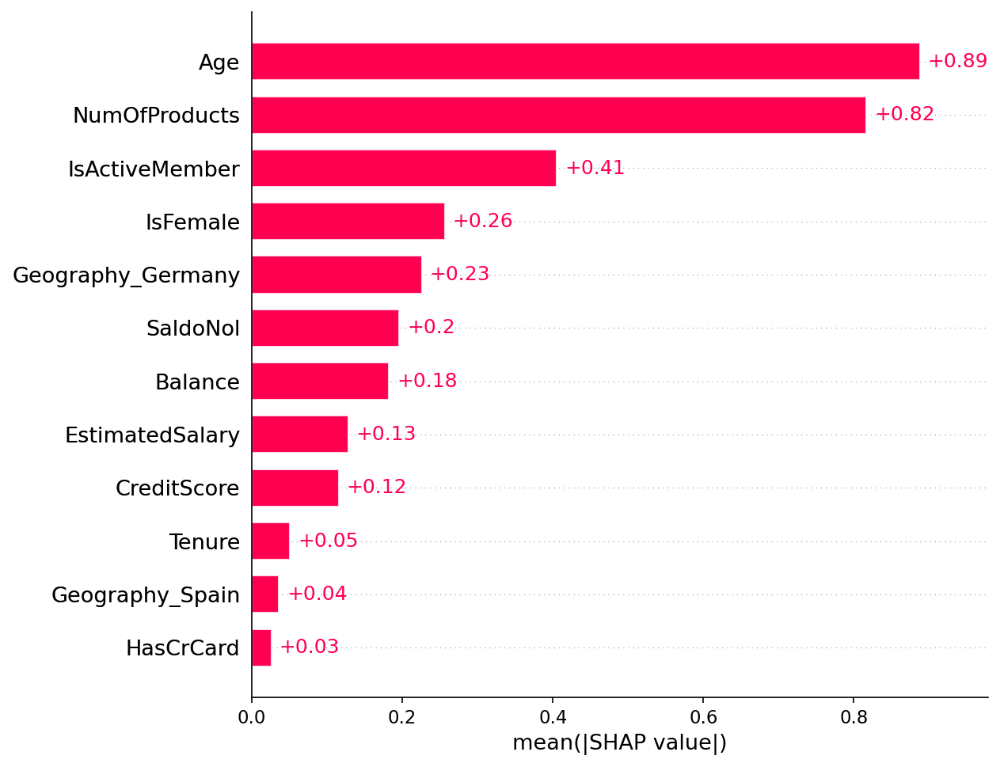
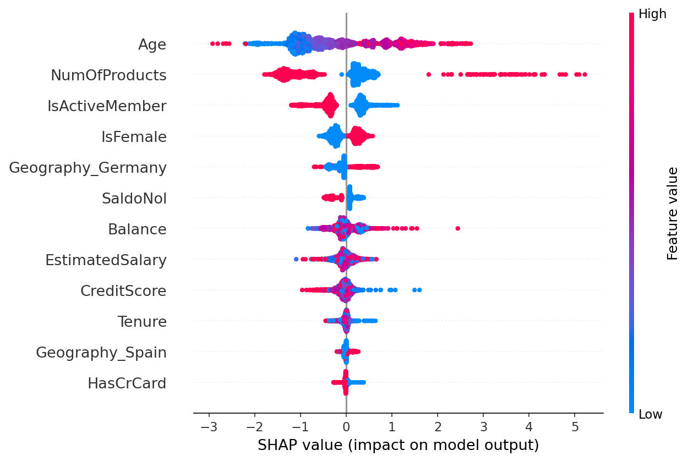

# Bank Customer Churn Prediction

Which bank customers are about to leave, why, and what should the bank do about it?
This project combines statistical testing, ensemble models and SHAP to answer those three questions on 10,000 bank customers.

**Notebook:** [bank_churn_analysis.ipynb](bank_churn_analysis.ipynb)

## Key results

- **XGBoost reaches ROC-AUC 0.864** (5-fold cross-validation) and catches **75% of customers who leave**, against 0.766 for the Logistic Regression baseline.
- The four strongest churn drivers are **age, number of products, inactivity and gender**, confirmed both by statistical tests and by SHAP.
- A confounding check showed that half of the apparent "customers with a balance churn more" effect came from Germany, where no customer has a zero balance.
- The best decision threshold depends on retention cost: **0.15** for a Rp100k offer, **0.80** for a Rp1m offer.

## Dataset

[Churn Modelling](https://www.kaggle.com/datasets/shrutimechlearn/churn-modelling) from Kaggle: 10,000 customers from France, Germany and Spain. Target: `Exited` (1 = left the bank). Churn rate is 20.4%, so the classes are imbalanced.

## Approach

1. **Cleaning:** removed identifier columns (`RowNumber`, `CustomerId`, `Surname`). No missing values or duplicates.
2. **Exploratory analysis:** churn rate per group instead of raw counts.
3. **Statistical testing:** chi-square for categorical features, Mann-Whitney U for numeric features, plus a confounding check by country.
4. **Modelling:** Logistic Regression (baseline), Random Forest and XGBoost with class weights for the imbalance, compared on precision, recall, F1 and ROC-AUC, then 5-fold cross-validation.
5. **Threshold selection:** total cost per threshold under different retention-cost assumptions.
6. **Explainability:** SHAP to show which features drive each prediction.

## Findings

| Group | Churn rate |
|---|---|
| Germany | 32.4% (France 16.2%, Spain 16.7%) |
| Inactive members | 26.9% (active 14.3%) |
| 1 product / 2 products / 3–4 products | 27.7% / 7.6% / 83–100% |
| Female | 25.1% (male 16.5%) |
| Has a credit card or not | 20.2% vs 20.8%, no significant difference |

Customers aged 45–60 leave most often, while customers above 70 are among the most loyal.

**Not significant:** credit card ownership, estimated salary and tenure (p > 0.05).

## Model performance

| Model | Precision | Recall | F1 | ROC-AUC (test) | ROC-AUC (5-fold CV) |
|---|---|---|---|---|---|
| Logistic Regression | 0.389 | 0.705 | 0.501 | 0.777 | 0.766 ± 0.021 |
| Random Forest | 0.629 | 0.641 | 0.635 | 0.863 | 0.860 ± 0.011 |
| XGBoost | 0.512 | 0.747 | 0.607 | 0.867 | 0.864 ± 0.013 |

Random Forest and XGBoost are statistically tied. Both clearly beat the linear baseline because churn is not linear in age or number of products.

## Choosing a threshold

The model gives a risk score; the threshold decides who the retention team contacts. Assuming a lost customer costs the bank Rp2 million:

| Retention offer cost | Cheapest threshold |
|---|---|
| Rp100,000 | 0.15 (contact broadly, miss almost no one) |
| Rp1,000,000 | 0.80 (contact only the highest-risk customers) |

## What drives churn (SHAP)

## Recommendations

| Finding | Recommendation |
|---|---|
| Customers with 3–4 products churn 83–100% | Review product bundling |
| Inactive members churn almost twice as often | Re-activation programme with reminders and first-transaction cashback |
| Ages 45–60 are the highest-risk group | Pre-retirement offers: investment, pension, priority service |
| German customers churn 32% | Investigate the German market: competitors, service, fees |
| Customers with a balance churn more | Rate or benefit offers for high-balance customers |
| The model catches 75% of leavers | Use risk scores to prioritise the retention call list |

## Limitations

- The 4-product group has only 60 customers, so its 100% churn rate needs verification.
- Retention costs are assumptions, not real bank figures.
- The model still uses `EstimatedSalary`, which was not significant in testing.
- Public data from three European countries; results may not transfer directly to Indonesian banks.

## Tools

Python, pandas, SciPy, scikit-learn, XGBoost, SHAP, matplotlib, seaborn, Google Colab

---

Made by **Winodya Zenitha** · [LinkedIn](https://www.linkedin.com/in/winodya-zenitha/) · [Portfolio](https://dz3rh3ycwu2ta.cloudfront.net)
